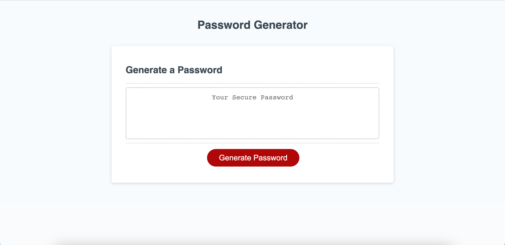

# secret-password-generator

## Description

I built this password generator website in order to further my skills and knowledge on the basics of Javascript. As a beginner coder, I wanted to gain experience building for loops, functions, and if statements along with understanding data strucures such as arrays. Along with this, my password generator is able to return a password based on the user's specifications on length and whether to include lowercase letters, uppercase letters, numbers, and special characters. During my experience working on this project, I learned how to arrive at logical solutions through code. 

## Usage

[This is the link to the completed application](https://erothman1.github.io/secret-password-generator/)

This is a screenshot to the completed application:

## How to Contribute

For information on how to contribute to this project, please email me at elva.rothman.developer@gmail.com!

